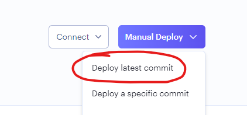
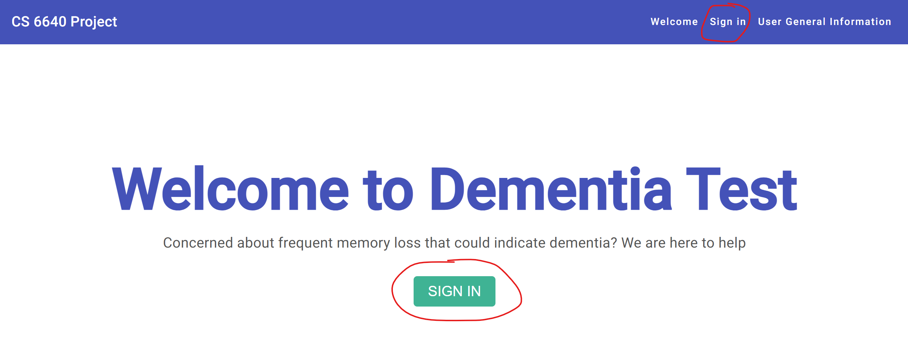
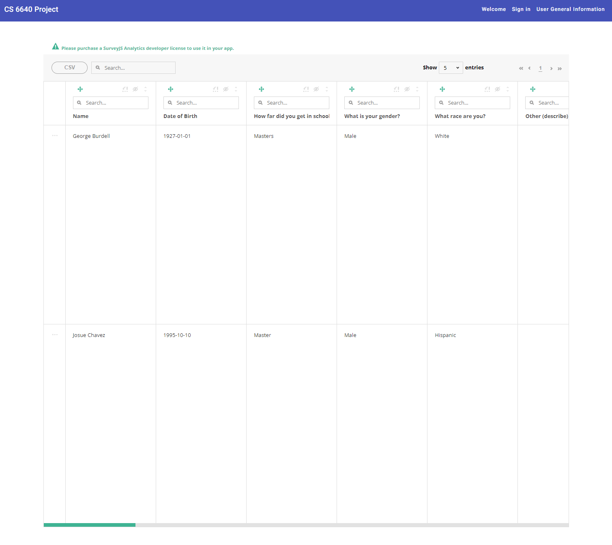
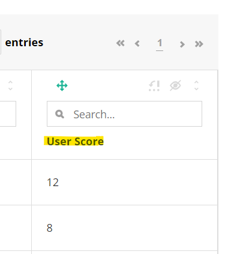
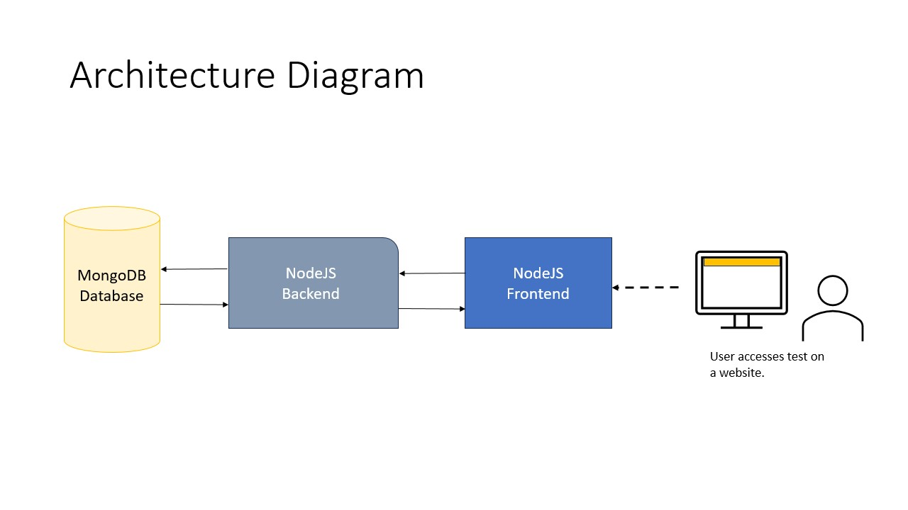
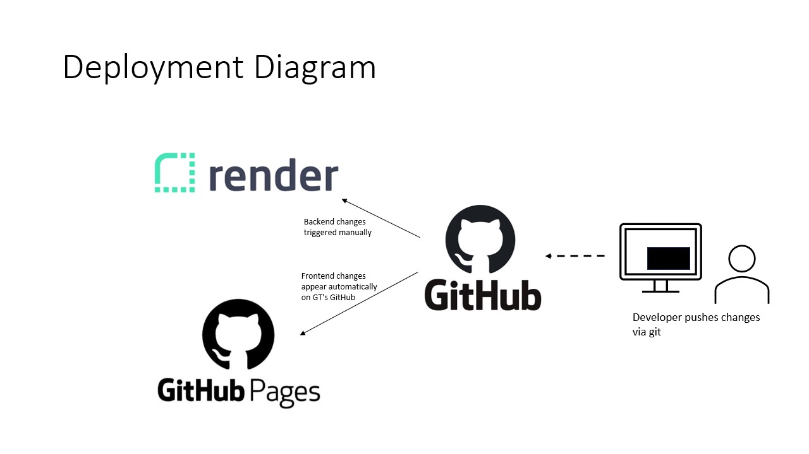
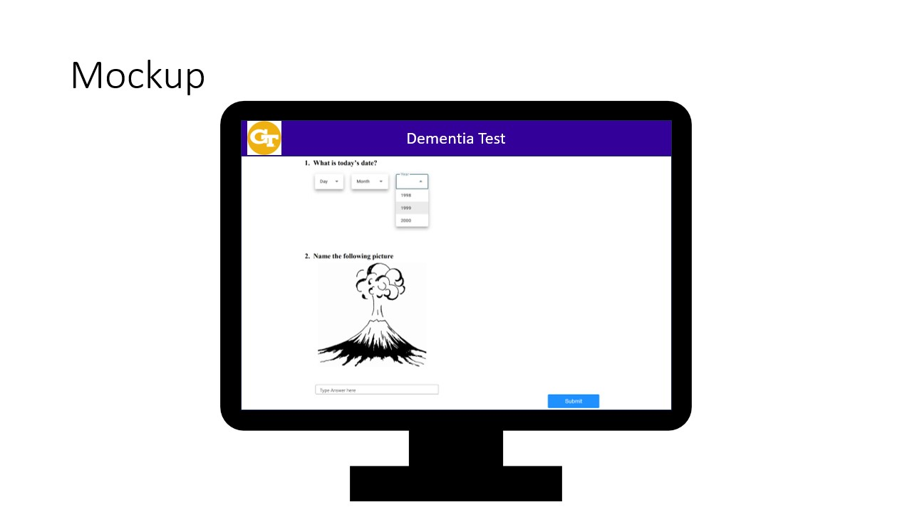
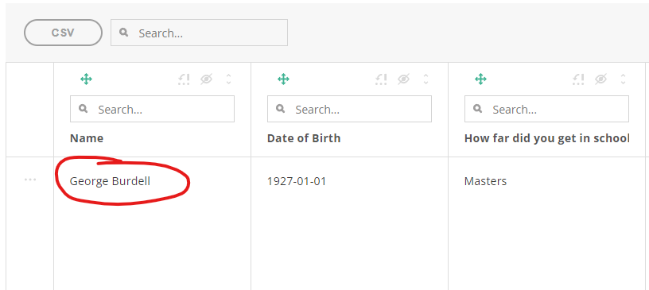
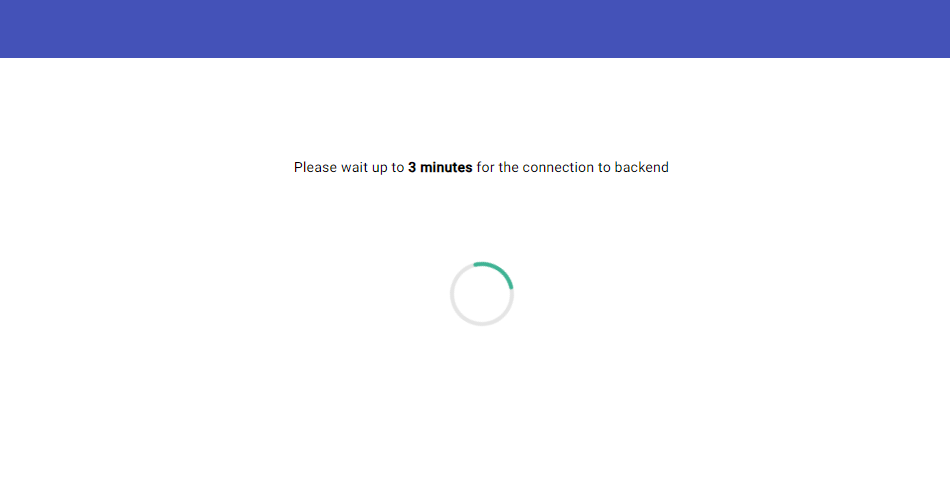

# CS 6640 Project - Dementia Test
An online interactive electronic form of a dementia test. View the website [here](https://github.gatech.edu/pages/jchavez42/CS-6440-Health-Informatics-Team-Project/prod).


- [CS 6640 Project - Dementia Test](#cs-6640-project---dementia-test)
  * [Technical/User Manual](#technical-user-manual)
    + [Deployment](#deployment)
      - [Deployment to static website (frontend)](#deployment-to-static-website--frontend-)
      - [Deployment to the Node Express server (backend)](#deployment-to-the-node-express-server--backend-)
    + [Instructions/Features](#instructions-features)
      - [Logging in](#logging-in)
      - [Taking the Dementia Test](#taking-the-dementia-test)
      - [Viewing User Results](#viewing-user-results)
      - [Seeing the grade](#seeing-the-grade)
    + [Development Setup](#development-setup)
      - [Setup NVM and Node](#setup-nvm-and-node)
      - [Installing packages](#installing-packages)
      - [Running the application](#running-the-application)
      - [Connecting to the MongoDB (Optional)](#connecting-to-the-mongodb--optional-)
  * [Research](#research)
  * [Architecture Diagrams](#architecture-diagrams)
  * [Startup and Configuration Files](#startup-and-configuration-files)
    + [Test data](#test-data)
    + [Troubleshooting](#troubleshooting)


## Technical/User Manual
### Deployment

#### Deployment to static website (frontend)
To deploy the application to a static hosting website such as GitHub pages, run `ng build --output-path prod --base-href https://github.gatech.edu/pages/jchavez42/CS-6440-Health-Informatics-Team-Project/prod/`. This will generate the static files inside the `prod/` folder this repo. Commit those generated files and push the changes to see the changes visible on [`https://github.gatech.edu/pages/jchavez42/CS-6440-Health-Informatics-Team-Project/prod`](https://github.gatech.edu/pages/jchavez42/CS-6440-Health-Informatics-Team-Project/prod). 

Note: you must be on the `main` branch to see the changes.

#### Deployment to the Node Express server (backend)
We use Render to deploy to our backend. It connects to GitHub and builds through manual triggers. The endpoint that the frontend talks to is `https://cs-6440-health-informatics-team-project.onrender.com`. See the [Architecture Diagram](#architecture-diagrams) to get more understanding of the workflow.

For deployment, see this [page for more info](https://render.com/docs/deploy-node-express-app) on how to deploy to the backend. The way it is set up for our repo is we push to the `main` branch and trigger manually through the website.



### Instructions/Features

#### Logging in
There are several ways to login. Either go to the Welcome home page and click on Login in the center or on the top left on the toolbar.



Below are the credential preloaded to access the website
- Patient
  - Username: `user`
  - Password: `user`
- Provider (admin)
  - Username: `admin`
  - Password: `admin`

#### Taking the Dementia Test
As the patient(`user`), login and it will redirect you to the Dementia Test page. Fill out information about the user taking the test and questions about them. Complete the questions that follow to start the test.


#### Viewing User Results
Too sign in as a provider (`admin`), click "Sign in" on the top right or in the welcome page. Login and it will redirect you to the Provider View Dashboard page.



#### Seeing the grade
Inside the Provider View Dashboard page, scroll the table all the way to right and see the score under "User Score" on the last column.



The way that scoring is done the quiz grades out of 12 possible points. The scoring guide comes from the [Ohio State University Self-Administered Gerocognitive Exam (SAGE)](https://wexnermedical.osu.edu/-/media/files/wexnermedical/patient-care/healthcare-services/brain-spine-neuro/memory-disorders/sage/us/sage_scoringinstructions_usuk_2021.pdf?rev=8d285147c07e4464816b5a06d24033f2&hash=43974E719E562B76BD768DC8ECBE4EF3)

### Development Setup

#### Setup NVM and Node
These steps were taken from Lab 4
1. `nvm install node` if you have never used NVM before, this should download the latest version
and ensure NVM is aware of all versions.
2. `nvm list` , note the label for version 18. It should be "lts/hydrogen".
3. `nvm install lts/hydrogen` to install version 18.
4. `nvm use lts/hydrogen` to change your local environment to the proper version.
5. If you wish to set your default version to 18, run `nvm alias default lts/hydrogen` otherwise you will have to run the previous command each time you reopen your environment.

#### Installing packages
1. Run `npm install -g @angular/cli`
1. Run `npm ci`

#### Running the application
Start the application by running  `npm run all`. Both the frontend and backend server should be running. Navigate to `http://localhost:4200/` on your browser.

In the event that either the frontend and backend isn't working, try the commands in 2 seperate terminals: 
- Run 'node index.js' to start the backend express server on `http://localhost:3000`. This is used to interact with the Mongo Database.
- Run `ng serve` for a dev server at `localhost:4200`. The application will automatically reload if you change any of the source files.

#### Connecting to the MongoDB (Optional)

You can connect to the MongoDB to see the documents (rows) using VS Code with the extension. See instructions below:
1. In VS Code, open "Extensions" in the left navigation and search for "MongoDB for VS Code." Select the extension and click install.
2. In VS Code, open the Command Palette.
Click on "View" and open "Command Palette."
Search "MongoDB: Connect" on the Command Palette and click on "Connect with Connection String."
3. Connect to your MongoDB deployment.
Paste your connection string into the Command Palette.
    ```
    mongodb+srv://6440-dem:<password>@6440-cluster.tmllwcj.mongodb.net/
    ```
Replace `<password>` with the password for the `6440-dem` user.


Resources:
- https://www.mongodb.com/languages/mean-stack-tutorial
- https://www.linode.com/docs/guides/mean-stack-tutorial/


## Research
SAGE is not an official diagnosis but rather a guidance for potential patients. It has been widely used as the very first step of assessment as it can detect common behavior patterns of dementia. Common symptoms:
- Forgetting things or recent events
- Losing or misplacing things
- Getting lost when walking or driving
- Being confused, even in familiar places
- Losing track of time
- Difficulties solving problems or making decisions
- Problems following conversations or trouble finding words
- Difficulties performing familiar tasks
- Misjudging distances to objects visually.

Full diagnosis is acquired from: physical exam, patient and family interview, cognitive screening, basic laboratory evaluation and structural imaging
 - Not cost effective and efficient when the number of people with dementia expected  to triple to 152 million by 2050

Future research has been focusing on using biomarkers to detect dementia at the earliest stages with the help from AI.
- Ex: Conversation and language tests extract acoustic features and linguistic features to detect the patterns consistent with dementia
- Ex: Computer-based clock drawing tests evaluates the performance of four machine learning methods (i.e. K-nearest neighbours (KNN), logistic regression model, SVM and random forest) to classify subjects into dementia and healthy control groups
  
The exam questions comes from [Ohio State University Self-Administered Gerocognitive Exam (SAGE)](https://wexnermedical.osu.edu/-/media/files/wexnermedical/patient-care/healthcare-services/brain-spine-neuro/memory-disorders/sage/us/sage_form2_us2021.pdf?rev=620a56e353d14b919d490d9a13d99320&hash=25C411E6FDB3A7DA8450630C115F09EA).

## Architecture Diagrams





## Startup and Configuration Files
To make the development workflow easy, we have two configuration files, [`environment.development.ts`](../src/environments/environment.development.ts) and [`environment.ts`](../src/environments/environment.ts). One is meant to be run locally in development and the other is used for production.
Database credenitals stored in [`index.js`](../src/index.js) under the field `uri`.

### Test data
There is a sample file [`sample-data.js`](../src/app/provider-view/sample-data.js) containing an entry for a patient named "George Burdell". It will show up on the first entry in the provider dashboard view page.



### Troubleshooting
Problem: Entries aren't showing up. 

Solution: It can take a while to get responses from the server. If it is To "wake up" the backend, login into the application go to the "Provider View Dashboard" by logging in as `admin` and wait until a table appears (takes ~3 minutes).

